# Muhammad Taimoor Khan

### COO at Digipex Solutions • Full Stack Developer • AI Automation Builder • Systems Thinker

  
  
  
  

---

## About Me

I am a builder who likes solving messy business problems with clean digital systems.

My work sits at the intersection of **full stack development, product thinking, AI automation, and operations**. I care about more than shipping code. I care about reducing friction, improving workflows, and building things that actually help teams move faster.

Right now, I work as the **COO at Digipex Solutions**, where I help lead projects across websites, applications, internal systems, automation, UI/UX, and growth-focused execution.

---

## What I Do

- Build modern websites, apps, dashboards, and internal tools
- Create AI-powered automations and workflow systems
- Work across WordPress, Laravel, Next.js, React, and Tailwind CSS
- Improve business operations through better system design
- Turn complex ideas into practical, scalable products
- Focus on execution, clarity, and real-world usability

---

## Current Focus

- AI automation for service businesses
- Full stack product development
- Operational systems and internal dashboards
- Conversion-focused website improvement
- Real-time tools and workflow-driven applications
- Simpler, more reliable digital experiences

---

## Tech Stack

### Core

  
  
  
  

### Frameworks and Libraries

  
  
  
  
  

### Tools and Platforms

  
  
  
  
  
  

---

## Work Style

I like work that combines:

- **strategy** so the solution makes business sense
- **systems thinking** so the workflow is sustainable
- **design awareness** so the user journey feels clear
- **engineering execution** so the final product is stable and useful

---

## Areas I Enjoy Building In

- Business websites that actually convert
- Internal tools that reduce manual work
- AI-assisted operational systems
- Product dashboards and admin panels
- Accessibility-aware product experiences
- Automation pipelines that remove repetitive tasks

---

## GitHub Overview

  

  

> These cards are intentionally referenced as local SVG files instead of the public `github-readme-stats` URL to avoid broken images and downtime.

---

## Let's Connect

I am always interested in building practical products, improving systems, and collaborating on work that creates real value.

  <a href="https://www.linkedin.com/in/myselftaimoor/">LinkedIn</a> •
  <a href="https://x.com/taaiimooor">X</a> •
  <a href="https://stackoverflow.com/users/23324858/muhammad-taimoor">Stack Overflow</a> •
  <a href="https://www.hackerrank.com/profile/taimoor_ak223">HackerRank</a>

